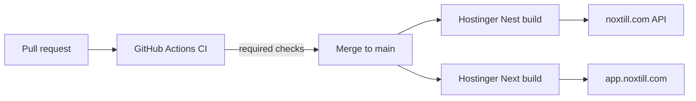

# CI/CD — Hostinger Git auto-deploy + GitHub branch protection

Production ships when a green CI run is merged to `main`. Hostinger then builds and restarts each Node.js app from that commit. There is no separate GitHub Actions “deploy” job.



## Domain layout

| App | URL | Hostinger root | Role |
|-----|-----|----------------|------|
| Backend | `https://noxtill.com` | `backend` | Nest API (`/api/v1`) |
| Frontend | `https://app.noxtill.com` | `frontend` | Next.js SSR |

## GitHub Actions CI

Workflow: [`.github/workflows/ci.yml`](../.github/workflows/ci.yml)

| Job | What it runs |
|-----|----------------|
| `backend` | `npm ci`, Prisma migrate + generate, lint, typecheck, unit tests, e2e, backup/restore drill (Postgres 16 + Redis 7) |
| `frontend` | `npm ci`, lint, typecheck, `next build` |

- **Node.js:** 22 (matches Hostinger)
- **Triggers:** push and pull_request to `main`
- **Concurrency:** one run per workflow + ref; newer runs cancel in-progress ones

Required status checks for branch protection must be named exactly **`backend`** and **`frontend`**.

## Merge gate (one-time GitHub setup)

Protect `main` so Hostinger only ever sees commits that passed CI:

1. Repo → **Settings** → **Branches** → **Add branch ruleset** (or classic branch protection) for `main`.
2. Require a pull request before merging.
3. Require status checks to pass: `backend`, `frontend`.
4. Do not allow administrators to bypass (recommended).

CLI equivalent (classic protection; adjust owner/repo):

```bash
gh api repos/{owner}/{repo}/branches/main/protection \
  --method PUT \
  --input - <<'EOF'
{
  "required_status_checks": {
    "strict": true,
    "contexts": ["backend", "frontend"]
  },
  "enforce_admins": true,
  "required_pull_request_reviews": {
    "required_approving_review_count": 0
  },
  "restrictions": null
}
EOF
```

If the API rejects `required_approving_review_count: 0`, use the UI and enable “Require a pull request” with zero approvals, or set the count to `1`.

## Hostinger — backend (Nest)

Already connected via Git for `noxtill.com`. Verify settings:

| Setting | Value |
|---------|--------|
| Application type | Nest (`nest`) |
| Branch | `main` |
| Node.js | 22 |
| Root directory | `backend` |
| Build script | `build` |
| Output directory | `dist` |
| Entry file | `main.js` (or `dist/main.js` if the panel requires a path under output) |
| Auto-deployment | On |

### Prisma on Hostinger

`backend/generated/prisma` is **gitignored**. The client must be generated on the Linux build host:

- `postinstall` → `prisma generate`
- `build` → `prisma generate && nest build`

If either script is missing, the app fails at boot with `Cannot find module '../../generated/prisma'`.

### Migrations

Hostinger’s Node build does **not** run migrations. Before or right after a release that adds migrations:

```bash
cd backend
DATABASE_URL='<production>' npx prisma migrate deploy
```

Use a machine that can reach production Postgres (SSH tunnel, bastion, or allowed IP).

### Backend env (hPanel)

Set production values from [PRODUCTION_DEPLOY_CHECKLIST.md](./PRODUCTION_DEPLOY_CHECKLIST.md). Minimum for this layout:

| Var | Production value (example) |
|-----|----------------------------|
| `NODE_ENV` | `production` |
| `CORS_ALLOWLIST` | `https://app.noxtill.com` |
| `FRONTEND_URL` | `https://app.noxtill.com` |
| `BACKEND_URL` | `https://noxtill.com` |
| `DATABASE_URL` | managed Postgres URL |
| `JWT_SECRET` / `JWT_REFRESH_SECRET` | fresh ≥32-char secrets |
| Redis / S3 / providers | as needed for live features |

## Hostinger — frontend (Next.js)

One-time setup:

1. Create subdomain **`app.noxtill.com`** (hPanel → Domains / Subdomains) under the same hosting account (`u721189487`).
2. **Websites** → **Add Website** → **Node.js web app** → **Import Git repository** (same repo as the backend).
3. Apply these settings:

| Setting | Value |
|---------|--------|
| Application type | Next (`next`) |
| Branch | `main` |
| Node.js | 22 |
| Root directory | `frontend` |
| Build script | `build` |
| Output directory | `.next` |
| Entry file | leave empty (Hostinger runs `next start`) |
| Auto-deployment | On |

4. Environment variables (injected at **build and runtime** — required for the public API URL baked into the client):

| Var | Value |
|-----|--------|
| `NEXT_PUBLIC_API_URL` | `https://noxtill.com/api/v1` |

See also [`frontend/.env.example`](../frontend/.env.example).

SSR mode (default) is correct for this app; do not set `output: 'export'` unless you intentionally move to a static-only frontend.

## Release flow

1. Open a PR to `main`.
2. Wait for `backend` and `frontend` CI jobs to pass.
3. Merge the PR.
4. Hostinger receives the push webhook and builds each connected app (Nest + Next).
5. If the PR included Prisma migrations, run `prisma migrate deploy` against production.
6. Smoke-test (below).

## Smoke checks

After both Hostinger deployments show **completed**:

1. **API:** `GET https://noxtill.com/api/v1/` → expect `200` (Hello World / health response).
2. **Frontend:** open `https://app.noxtill.com` → app loads without console errors pointing at `localhost`.
3. **CORS:** sign in from the app; browser must not block API calls (confirm `CORS_ALLOWLIST` includes the app origin).
4. Optional journey: signup → product → sale → nightly-close aggregate → review-request `/r/:token`.

## Rollback

- In hPanel **Deployments**, redeploy the previous known-good commit for the affected app, or revert the bad merge on `main` (another green CI + Hostinger rebuild).
- DB migrations are additive so far; prefer restoring from backup only if a release depends on schema the old code cannot run. See [PRODUCTION_DEPLOY_CHECKLIST.md](./PRODUCTION_DEPLOY_CHECKLIST.md) §5.

## Troubleshooting

| Symptom | Likely cause |
|---------|----------------|
| `Cannot find module '../../generated/prisma'` | `prisma generate` did not run; confirm `postinstall`/`build` scripts and that Hostinger runs install + build |
| Frontend calls `localhost:5000` | `NEXT_PUBLIC_API_URL` missing in Hostinger frontend env; rebuild after setting it |
| CORS errors in browser | Backend `CORS_ALLOWLIST` missing `https://app.noxtill.com` |
| Deploy did not start on merge | Hostinger Git connection / branch mismatch; confirm auto-deployment and `main` |
| CI green but Hostinger fails | Check Hostinger build logs (Node version, OOM, missing prod env for Nest boot) |
